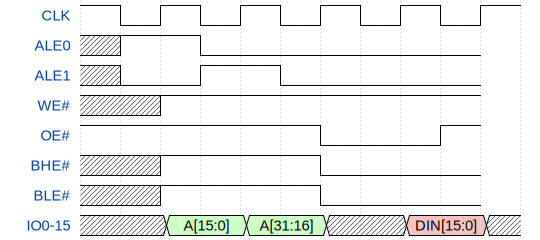
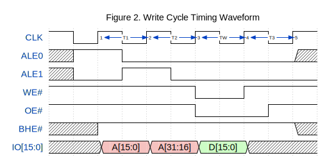
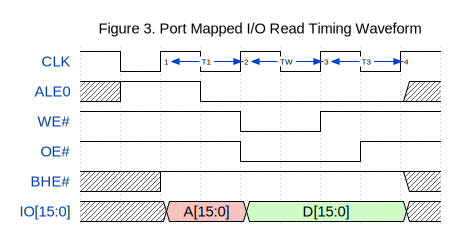

# CPU Datasheet

## Pinout

| Pin # | Name | Description |
|-|-|-|
| 0-15 | IO0-15 | **Address/Data Parallel Bus:** These lines contain the time-multiplexed address (T1, T2) and data (TW, T4) buses. During the T1 cycle, bits A0-A7 of the address bus is outputted. Bit A0 is the BLE# signal. It is LOW during T1 if only the low 8-bits is to be transferred during memory or I/O operations. |
| 16 | ALE0 | **Address Latch Enable (LOW):** HIGH during T1 to signal for the latching of the low 8-bits of the address signal. It is LOW otherwise. |
| 17 | ALE1 | **Address Latch Enable (HIGH):** HIGH during T2 to signal for the latching of the high 8-bits of the address signal. It is LOW otherwise. |
| 18 | WE# | **Write Enable:** Write strobe is LOW during TW to indicate that the processor is performing an I/O or memory write operation. |
| 19 | OE# | **Output Enable:** When LOW, indicates that the processor IO lines are ready to accept/output data. It is held HIGH during T1 and T2. |
| 20 | BHE# | **Bus High Enable:** When LOW, signals for the high 8-bits to be transferred during memory or I/O operations. |
| 22 | PIO | **IO Mode:** When HIGH, indicates that the current operation is an I/O, not memory, operation. This results in the omittance of cycle T2. |
| 23, 24 | RX, TX | 9600 Baud UART Interface |
| 25-... | GPIO0-... | General Purpose Input/Output |

**Notes:**
- By adding an extra ALE3 (24-bit address bus) and/or ALE4 (32-bit address bus), 8 more bits can be saved from the IO pins
- The PIO pin is no-connect and is there for the possibility of peripheral interfaces
- If IRQ signals are required, each GPIO signal should generate an interrupt
- GPIO pins are all digital without PWM support. ADCs and IO expansions can be attached later to this or to the IO/data bus with the help of the PIO pin. Someone just has to work out the timing waveforms.

**Recommended Chips:**
- CY62147G variant for 4M (512x16) SRAM (55ns rw cycle)
- 74xx373/573 for address latches (as fast as 1ns tpd)
- 74xx245 for tristate bus buffers if needed
- Some I2C/SPI GPIO expansion
- Some ADC for analogue input (I'm not sure what to use)

---
## Timing Waveforms

Various timing diagrams of the address and data buses

### Read Cycle

Clock Cycles: 4 minimum

Timing Requirements:
- The duration of the TW read clock (no data input) is determined by the `tpd` of whichever memory chip used.
- TW can span multiple clock periods to allow for different memory timings. This will allow the CPU to be clocked at a higher speed than the memory chips.

In implementation, OE# is the AND of 2 signals, one leading edge and one falling edge driven signals.

<!-- WAVEDROM JSON FILE
{ signal: [
  { name: "CLK",		wave: "hlhlhlhlhlh", node: "..1.2.3.4.5" },
  { name: "ALE0",		wave: "xh.l......x" },
  { name: "ALE1",		wave: "xl.h.l....." },
  { name: "WE#",		wave: "h.........." },
  { name: "OE#",		wave: "h.....l..h." },
  { name: "BHE#",		wave: "x.h.......x" },
  { name: "IO[15:0]",	wave: "x.9.9.x.5.x", data:[ "A[15:0]", "A[31:16]", "D[15:0]" ] },],
  head: { text: "Figure 1. Read Cycle Timing Waveform" },
  edge: [ '1<->2 T1', '2<->3 T2', '3<->4 TW', '4<->5 T3' ]
} -->

### Write Cycle

Clock Cycles: 4 minimum

Timing Requirements:
- See the read cycle specifications

<!-- WAVEDROM JSON FILE
{ signal: [
  { name: "CLK",		wave: "hlhlhlhlhlh", node: "..1.2.3.4.5" },
  { name: "ALE0",		wave: "xh.l......x" },
  { name: "ALE1",		wave: "xl.h.l....." },
  { name: "WE#",		wave: "h.....l.h.." },
  { name: "OE#",		wave: "h.....l..h." },
  { name: "BHE#",		wave: "x.h.......x" },
  { name: "IO[15:0]",	wave: "x.9.9.7.x..", data:[ "A[15:0]", "A[31:16]", "D[15:0]" ] },],
  head: { text: "Figure 2. Write Cycle Timing Waveform" },
  edge: [ '1<->2 T1', '2<->3 T2', '3<->4 TW', '4<->5 T3' ]
} -->

### Port-Mapped IO Write Cycle

Clock Cycles: 4 minimum

Timing Requirements:
- External circuitry required for latching if timing requirements not met
- I have not managed to get this to work properly yet

<!--  -->
